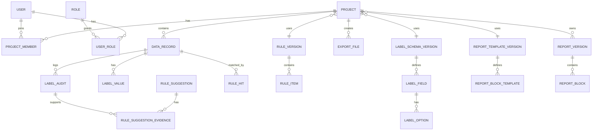

# 数据模型草图

## 1. 核心对象关系



## 2. 项目 Project

项目是所有数据、规则、标签、报告、导出的容器。

关键字段：

- project_id
- project_name
- client_name
- brand_name
- data_source
- label_schema_version_id
- rule_version_id
- report_template_version_id
- file_naming_pattern
- export_column_profile_id
- status
- created_by
- created_at
- updated_at

## 3. 标签体系 Label Schema

标签体系支持不同项目选择不同逻辑。

### LabelSchemaVersion

- schema_version_id
- schema_name
- version
- description
- status
- copied_from_version_id

### LabelField

- field_id
- schema_version_id
- field_key
- field_name
- field_type：single_select / multi_select / text / number / boolean
- parent_field_id：用于二级联动
- required
- visible_in_grid
- visible_in_report
- sort_order

### LabelOption

- option_id
- field_id
- parent_option_id
- option_label
- option_value
- color
- sort_order
- enabled

情绪层示例：

```text
field: sentiment_polarity
options: 正面 / 中性 / 负面

field: sentiment_type
parent_field: sentiment_polarity
options:
  负面 -> 恐慌焦虑 / 庆幸旁观 / 愤怒背叛 / 质疑不信任
  中性 -> 事实陈述 / 询问求证 / 旁观讨论
  正面 -> 认可 / 信任 / 推荐 / 感谢
```

## 4. 数据记录 DataRecord

记录原始内容和导入字段。

关键字段：

- record_id
- project_id
- source_row_index
- platform
- publish_time
- author_name
- content
- comment_content
- raw_payload_json
- clean_status
- is_valid
- report_candidate
- created_at

## 5. 标签值 LabelValue

标签值区分自动、人工、最终。

- label_value_id
- project_id
- record_id
- field_id
- auto_value
- auto_rule_version_id
- auto_rule_hit_id
- manual_value
- final_value
- is_human_confirmed
- confirmed_by
- confirmed_at
- last_saved_by
- last_saved_at

最终值规则：

```text
if is_human_confirmed:
    final_value = manual_value
else:
    final_value = manual_value or auto_value
```

## 6. 标签审计 LabelAudit

每次人工保存都写日志。

- audit_id
- project_id
- record_id
- field_id
- before_value
- after_value
- source：manual_edit / batch_edit / auto_label / rule_rerun
- edited_by
- edited_at
- save_batch_id
- note

黄色点 hover 依赖这个对象。

## 7. 规则版本 RuleVersion

- rule_version_id
- project_id nullable
- rule_set_name
- version
- status
- created_from_version_id
- created_by
- created_at

## 8. 规则项 RuleItem

- rule_item_id
- rule_version_id
- target_field_id
- target_value
- keywords
- exclude_keywords
- pattern
- priority
- confidence
- enabled
- note

## 9. 规则学习建议 RuleSuggestion

规则学习建议必须由人工确认后才进入规则版本。

- suggestion_id
- project_id
- base_rule_version_id
- target_field_id
- suggested_value
- suggestion_type：add_keyword / remove_keyword / adjust_priority / split_label / merge_label
- summary
- evidence_count
- llm_summary
- status：pending / accepted / ignored / edited_accepted
- reviewed_by
- reviewed_at

## 10. 报告对象

### ReportTemplateVersion

- template_version_id
- template_name
- version
- copied_from_version_id
- status

### ReportVersion

- report_version_id
- project_id
- template_version_id
- version
- status：draft / reviewing / approved / exported
- title
- edited_by
- updated_at

### ReportBlock

- block_id
- report_version_id
- block_type：text / chart / table / sample_list / insight
- title
- content_json
- sort_order
- data_query_config

## 11. 导出文件 ExportFile

- export_id
- project_id
- report_version_id nullable
- asset_type：excel / word / pdf / ppt
- file_name
- file_path
- file_size
- naming_pattern
- created_by
- created_at

