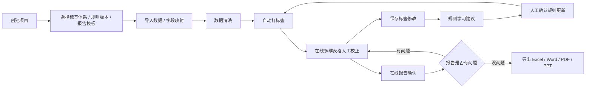

# 产品蓝图

## 1. 产品定位

这个平台不是单一项目的舆情报表工具，而是一个可配置标签体系的舆情智能标注与报告生产平台。

核心能力：

- 代码根据当前规则自动打标签
- 人工在在线多维表格中校正标签
- 系统记录自动标签和人工标签差异
- 系统总结差异并生成规则优化建议
- 人工确认规则更新，形成新规则版本
- 在线报告持续确认，有问题回到标签和规则继续修改
- 最终导出 Excel、Word、PDF、PPT

## 2. 业务闭环



## 3. 标签体系

标签体系必须可配置、可复制、可版本化。

当前 A2 项目采用三层逻辑：

| 层级 | 说明 | 示例 |
| --- | --- | --- |
| 认知层 | 用户对事件、品牌、信息的理解状态 | 无明确认知、信息混淆、精准认知、泛化抵触 |
| 情绪层 | 两级结构：一级情绪极性，二级情绪类型 | 一级：正面/中性/负面；二级：恐慌焦虑、庆幸旁观、愤怒背叛 |
| 行动层 | 用户是否出现进一步行为意图 | 暂无行动、寻求帮助、转奶流失、维权诉求 |

未来可扩展标签：

- 风险等级：低 / 中 / 高 / 危机
- 议题类型：产品质量 / 价格 / 安全 / 成分 / 服务 / 品牌信任
- 用户意图：咨询 / 投诉 / 推荐 / 求证 / 跟风 / 抵制
- 传播价值：高影响 / 普通 / 噪音
- 渠道角色：原帖 / 评论 / 回复 / 二创扩散
- 品牌关系：本品牌 / 竞品 / 泛品类 / 无品牌
- 报告引用价值：可引用 / 不建议引用 / 需人工复核

## 4. 自动打标优先级

1. 人工确认标签：最高优先级，后续规则重跑不覆盖
2. 当前项目规则：用于自动打标
3. 规则学习建议：只生成建议，不自动生效
4. LLM 辅助总结：只提供解释和提示，不直接修改规则

## 5. 人工标注核心体验

人工标注页是整个产品的核心页面，需要按在线多维表格设计，而不是普通后台表格。

关键能力：

- 大表格，每屏至少 20-50 行
- 项目配置决定展示哪些标签列
- 标签列支持下拉选择
- 多级标签联动下拉
- 单元格双击编辑
- 支持复制粘贴、批量填充、筛选、排序、搜索
- 支持冻结关键列
- 支持紧凑 / 标准 / 大文本行高
- 定时自动保存
- 黄色点表示人工确认
- hover 显示确认人、时间、修改前后标签
- 规则重跑不覆盖人工确认数据

## 6. 报告模块

报告是在线确认流程，不只是导出结果。

能力范围：

- 报告模板 CRUD
- 模板版本管理
- 复制模板
- 在线编辑报告文字
- 图表模块可配置数据来源
- 表格样式可调整
- 报告样本内容可追溯到底层数据
- 报告版本管理
- 导出 Word / PDF / PPT

文件命名支持变量：

```text
{project_name}_{asset_type}_{version}_{date}
```

示例：

```text
A2舆情分析_数据明细_v03_20260605.xlsx
A2舆情分析_正式报告_v03_20260605.docx
A2舆情分析_汇报版_v03_20260605.pptx
```

## 7. 用户角色

| 角色 | 权限重点 |
| --- | --- |
| 超级管理员 | 管理全部项目、用户、规则、模板、系统配置 |
| 项目管理员 | 管理单个项目配置、成员、规则版本、报告版本 |
| 标注员 | 导入数据、编辑标签、确认标签 |
| 分析师 | 编辑报告、调整图表、选择样本、导出报告 |
| 审阅者 | 查看数据和报告，不修改 |
| 客户访客 | 只查看被授权的在线报告 |

